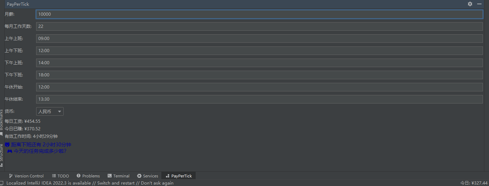
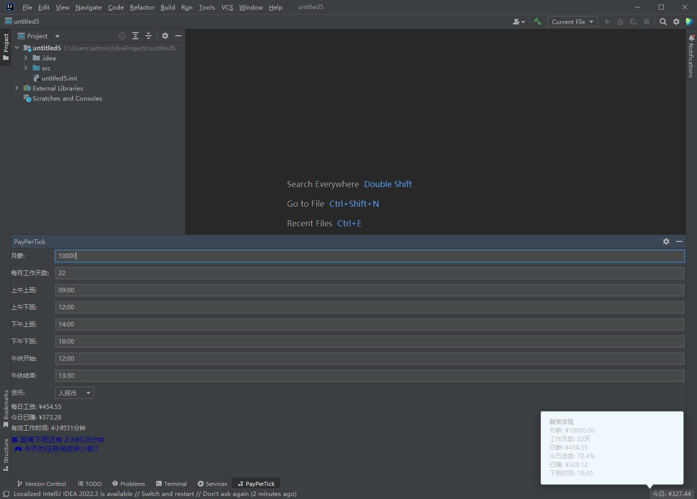

# 💸「码农财富计时器」——你的代码，每秒都在赚钱！

> 嘿，程序员朋友！👨‍💻👩‍💻 还在疑惑自己加班到底**值不值**？想不想知道你敲的每一行代码**值多少钱**？

**「码农财富计时器」**来啦！✨ 这是一款超有趣的IDEA插件，让你**像看股票一样**，实时盯着自己的**每秒工资**涨涨涨！

为什么你需要这个插件？
* ⌛ 时间就是金钱：你的IDE右下角会显示「当前每秒赚：¥0.017」，摸鱼时数字狂掉，搬砖时数字狂飙！
* 💡 加班清醒剂：当你犹豫要不要接需求时，看看「这个需求值我多少秒生命」，瞬间清醒！
* 🎢 刺激打工体验：代码编译时？工资暂停！debug成功？工资暴涨！**编程就像玩大富翁！**
* 🤣 程序员专属梗：
  - "老板，我刚刚给你赚了3毛2！"
  - "这段屎山代码居然花了我5块钱..."
  - "今天开会2小时，血亏¥12.8！"

🚀 **怎么玩？** 

1️⃣ 输入你的**月薪**（比如30000，梦想总要有的）

2️⃣ 设置**每天搬砖几小时**（默认8，但我知道你肯定不止）

3️⃣ 选择**每月打工几天**（22天？天真！）

4️⃣ 看！IDE右下角开始跳数字了！

🤑 **高级功能（假装很专业）**
**「摸鱼模式」**：临时屏蔽计算，避免发现自己时薪低于奶茶店员时心态爆炸💥
**「老板键」**：一键隐藏，防止路过同事发现你在算这个（嘘~）
**「扎心对比」**：把你的每秒工资和**星巴克咖啡**价格对比（结果可能引起不适）

📢 程序员忠告：

*"当你发现自己的每秒工资还不够买粒芝麻时——

要么去要求加薪，要么去学如何用AI自动写代码！"*

👉 现在安装，立刻体验「边编程边数钱」的快乐！

（免责声明：本插件可能引起对薪资的深刻反思，请谨慎使用😏）
#### 体验
配置你的工作信息 悄悄告诉你,加班和即将下班都会有不同的语句输出哦~

查看我的工作数据

#### 🧑‍💻 贡献指南
##### 欢迎提交PR！特别是:
* 新的薪资计算模型
* 创意可视化方案
* 更扎心的对比数据(比如对比大厂股票涨幅)
